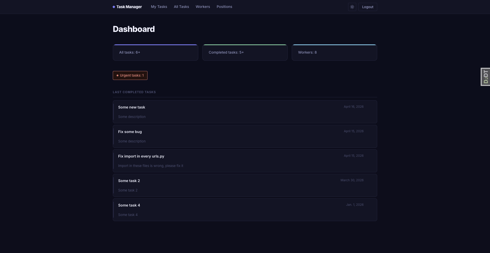
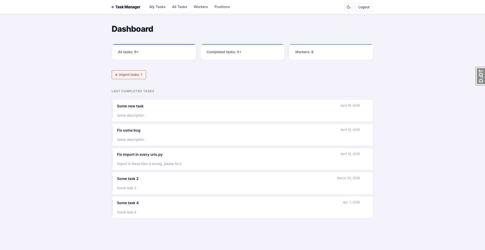

# 📋 Task Manager System

A powerful and intuitive Django-based web application designed to streamline team collaboration, track tasks, and manage employee workloads efficiently.

## 🖼 Project Preview

|           Dark Theme Dashboard            |            Light Theme Dashboard            |
|:-----------------------------------------:|:-------------------------------------------:|
|  |  |

---

## 🚀 Features

- **User Authentication**: Secure login/logout system for workers.
- **Task Management**: Create, update, delete, and track tasks with status and priority.
- **Advanced Filtering**: Search tasks by name, filter by priority, completion status, or sort by deadline.
- **Worker Management**: Detailed profiles for workers with their assigned tasks and positions.
- **Analytics Dashboard**: Quick overview of total tasks, urgent matters, and team statistics.
- **Responsive UI**: Clean interface built with modern CSS and optimal user experience.

## 🛠 Tech Stack

* **Framework:** Django 5.x
* **Database:** SQLite (Development)
* **Styling:** Custom CSS with CSS Variables
* **Tools:** Django Debug Toolbar

## 📦 Installation

1.  **Clone the repository:**
    ```bash
    git clone https://github.com/viloker/task_manager.git
    ```
    ```bash
    cd task_manager
    ```

2.  **Create and activate a virtual environment:**
    ```bash
    python -m venv venv
    ```
    *Windows:*
    ```bash
    venv\Scripts\activate
    ```
    *Linux/macOS:*
    ```bash
    source venv/bin/activate
    ```

3.  **Install dependencies:**
    ```bash
    pip install -r requirements.txt
    ```

4.  **Apply migrations:**
    ```bash
    python manage.py migrate
    ```

5.  **Load initial data (Optional):**
    Populate the database with predefined workers, positions, task types, and tasks:
    ```bash
    python manage.py loaddata test_data.json
    ```

6.  **Create a superuser:**
    ```bash
    python manage.py createsuperuser
    ```

7.  **Run the development server:**
    ```bash
    python manage.py runserver
    ```

## 🧪 Testing

The project is covered with unit tests for models and views. To run them, use:

```bash
python manage.py test